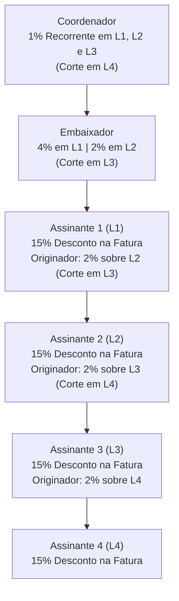
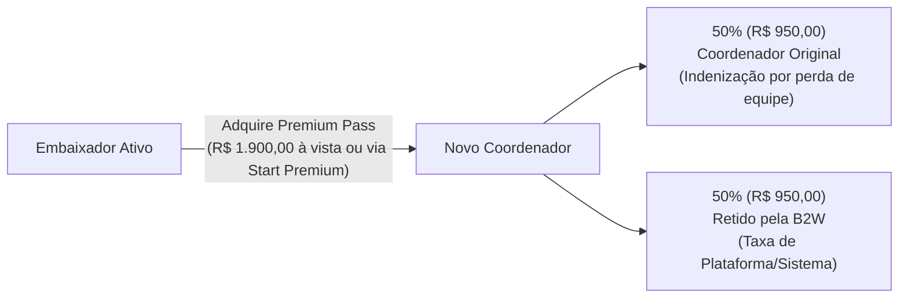
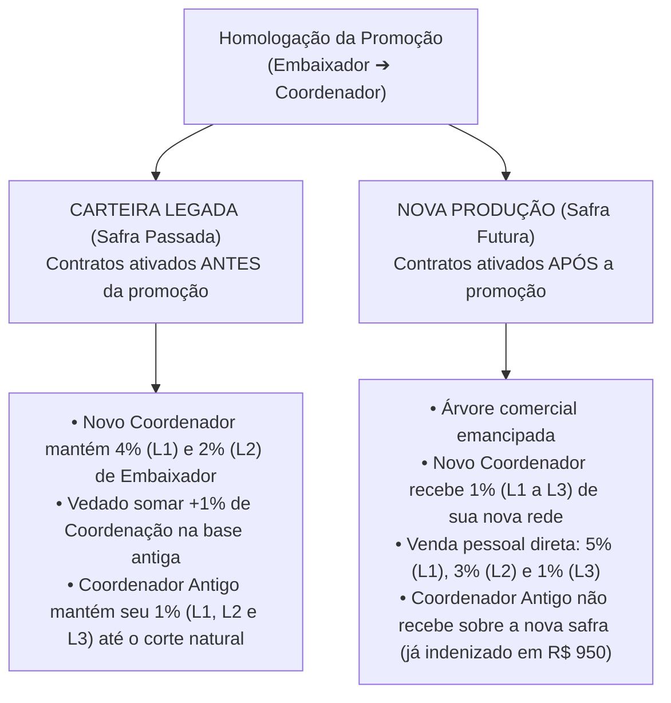

# Playbook Comercial, Governança e Plano de Recompensas — HUB B2W Energia Solar

> **Diretório Oficial do Projeto:** `Plano de Recompensas`  
> **Escopo:** Estruturação financeira, matriz de comissionamento multinível com teto travado, regras de transição de carreira (*Safra Fechada*), análise de *Breakeven* e expansão do ecossistema (Usinas, Investidores, Integradores, Corretores e Eletropostos).  
> **Fonte Original:** [Material Compartilhado Gemini](https://share.gemini.google/aOsIfQmgoJxW)

---

## 1. Visão Geral e Premissas Tarifárias (Base Líquida)

Para blindar a operação contra a inflação regulatória, variações tributárias e o escalonamento do Fio B (Lei 14.300), **nenhuma comissão incide sobre a tarifa bruta ou sobre a Contribuição de Iluminação Pública (CIP)**.

Todas as bonificações e recorrências incidem estritamente sobre a **Base de Cálculo Líquida Faturável**, apurada após a dedução do desconto comercial concedido ao assinante e do custo regulatório de distribuição (**Fio B**).

### 1.1. Composição da Base de Cálculo (Exemplo de Referência: Cosern)

* **Tarifa de Referência da Concessionária (sem CIP):** `R$ 1,020 / kWh`
* **(-) Custo Regulatório de Distribuição (Fio B):** `- R$ 0,210 / kWh`

| Métrica Financeira | Plano Ultra (15% Desconto) | Plano Premium (20% Desconto) |
| :--- | :---: | :---: |
| **Tarifa Bruta Concessionária (s/ CIP)** | `R$ 1,020 / kWh` | `R$ 1,020 / kWh` |
| **(-) Fio B (Custo Regulatório)** | `- R$ 0,210 / kWh` | `- R$ 0,210 / kWh` |
| **(-) Desconto Comercial do Assinante** | `- R$ 0,153 / kWh` (15%) | `- R$ 0,204 / kWh` (20%) |
| **(=) Base Líquida de Comissionamento** | **`R$ 0,657 / kWh` (~`R$ 0,66`)** | **`R$ 0,606 / kWh`** |

---

## 2. Portfólio de Planos ao Assinante Final

### 2.1. Plano Ultra (Foco em Viralidade, Rede e Retenção)
* **Desconto na Ponta:** **15% recorrente** sobre a tarifa de energia da concessionária (excluída a CIP).
* **Mecânica *Member-Get-Member* (Assinante Originador):** Qualquer assinante que indicar um novo cliente torna-se um **Assinante Originador**, passando a receber **2% de bônus recorrente** sobre a Base Líquida (`R$ 0,657/kWh` $\rightarrow$ **`R$ 0,0132 / kWh`**) da fatura do seu indicado direto (**L1**).
* **Forma de Liquidação do Bônus:** Exclusivamente como **crédito de abatimento na própria fatura de energia**, limitado ao valor total da sua conta no mês (não gera saldo credor acumulável nem repasse em dinheiro via PIX/TED).
* **Proporção para Conta Zerada (Quitação Integral):**
  * Saldo a pagar por kWh consumido após desconto de 15%: `R$ 1,020 - R$ 0,153 = R$ 0,867 / kWh`
  * Crédito gerado por kWh indicado (2% de `R$ 0,66`): `R$ 0,0132 / kWh`
  * **Razão de Quitação:** $\frac{R\$ 0,867}{R\$ 0,0132} \approx \mathbf{65,68\text{ kWh indicados por }1\text{ kWh consumido}}$ (aproximadamente **66 assinantes indicados** com o mesmo perfil de consumo).

### 2.2. Plano Premium (Foco em Conversão Rápida e Liquidez Imediata)
* **Desconto na Ponta:** **20% fixo recorrente** sobre a tarifa de energia da concessionária (excluída a CIP).
* **Mecânica de Indicação:** Não possui programa de recorrência para assinantes originadores.
* **Modelo de Comissionamento Comercial:** Pagamento único (*Upfront / Start*) equivalente a **100% da Base Líquida da 1ª fatura (`R$ 0,606 / kWh`)**, dividido entre Embaixador e Coordenador.

---

## 3. Matriz de Comissionamento e Regras de Níveis

### 3.1. Regras de Corte por Papel (Plano Ultra - Recorrência Mensal)
1. **Assinante Originador:** Recebe **2%** (`R$ 0,0132/kWh`) exclusivamente sobre o seu indicado direto (**L1 dele**). Sofre corte imediato na linha seguinte (**L2 dele**).
2. **Embaixador:** Recebe **4%** (`R$ 0,02628/kWh`) em **L1** (indicação direta) e **2%** (`R$ 0,01314/kWh`) em **L2** (indicação indireta). Sofre corte em **L3**.
3. **Coordenador:** Recebe **1%** fixo (`R$ 0,00657/kWh`) sobre **L1, L2 e L3** da árvore de seus embaixadores. Sofre corte em **L4**.

### 3.2. Tabela de Distribuição por Nível de Fatura (Plano Ultra)
*(Valores baseados na Base Líquida de `R$ 0,657 / kWh`)*

| Nível da Fatura Geradora | Desconto Assinante | Assinante Originador (Crédito Fatura) | Embaixador (Comissão) | Coordenador (Comissão) | Carga Total do Pool B2W |Receita Líquida Usina/B2W |
| :--- | :---: | :---: | :---: | :---: | :---: | :---: |
| **Fatura L1** (Assinante 1) | 15% (`R$ 0,153`) | — | **4%** (`R$ 0,026`) | **1%** (`R$ 0,006`) | **5%** (`R$ 0,033`) | `R$ 0,624 / kWh` |
| **Fatura L2** (Assinante 2) | 15% (`R$ 0,153`) | **2%** (`R$ 0,013` p/ Assinante 1) | **2%** (`R$ 0,013`) | **1%** (`R$ 0,006`) | **5%** (`R$ 0,033`) | `R$ 0,624 / kWh` |
| **Fatura L3** (Assinante 3) | 15% (`R$ 0,153`) | **2%** (`R$ 0,013` p/ Assinante 2) | 0% *(Corte L3)* | **1%** (`R$ 0,006`) | **3%** (`R$ 0,019`) | `R$ 0,638 / kWh` |
| **Fatura L4+** (Assinante 4+) | 15% (`R$ 0,153`) | **2%** (`R$ 0,013` p/ Assinante 3) | 0% *(Corte)* | 0% *(Corte L4)* | **2%** (`R$ 0,013`) | `R$ 0,644 / kWh` |

### 3.3. Regras de Absorção e Vacância
* **Venda Direta do Coordenador (Sem Embaixador Intermediário):** O Coordenador absorve integralmente as alíquotas do Embaixador naquela linha:
  * **L1 Direto:** `1% (Coordenação) + 4% (Embaixador) = 5%` sobre a base líquida.
  * **L2 Indireto:** `1% (Coordenação) + 2% (Embaixador) = 3%` sobre a base líquida.
  * **L3 Indireto:** `1% (Coordenação)` sobre a base líquida.
* **Embaixador Sem Coordenador:** A parcela de **1%** destinada à coordenação **retorna integralmente para o caixa da B2W**.

### 3.4. Regras do Plano Premium (Pagamento Único / Start)
Sobre a Base Líquida do Plano Premium (`R$ 0,606 / kWh`), paga-se 100% da base da 1ª fatura em parcela única:
* **Embaixador:** **50%** da base líquida (`R$ 0,303 / kWh`).
* **Coordenador:** **50%** da base líquida (`R$ 0,303 / kWh`).
* **Venda Direta pelo Coordenador (Sem Embaixador):** Absorve **100%** da base líquida (`R$ 0,606 / kWh`).

---

## 4. Análise de Ponto de Equilíbrio (*Breakeven*)

Premissa de simulação: **Cliente padrão com consumo médio de `300 kWh / mês`** (`Tarifa R$ 1,02/kWh`, `Fio B R$ 0,21/kWh`).

### 4.1. Visão do Assinante (Plano Premium 20% vs. Plano Ultra 15% + Indicações)
* **Plano Premium (20% fixo):** Desconto de `R$ 61,20 / mês` (`R$ 734,40 / ano`) sem esforço de indicação.
* **Plano Ultra (15% fixo):** Desconto base de `R$ 45,90 / mês`. Diferença a cobrir: `R$ 15,30 / mês`.
* **Bônus por Indicado de 300 kWh (2% sobre `R$ 0,66`):** `300 kWh × R$ 0,0132 = R$ 3,96 / mês` por indicado.
* **Breakeven do Assinante:** Precisa indicar **4 clientes de 300 kWh** (`4 × R$ 3,96 = R$ 15,84/mês`) para empatar/superar o desconto de 20% do Plano Premium, e **66 clientes de 300 kWh** para zerar a fatura (`R$ 260,10`).

### 4.2. Visão Comercial (Embaixador e Coordenador: Ultra Recorrente vs. Premium Único)

| Papel Comercial | Ganho Único no Premium (por cliente 300 kWh) | Ganho Mensal Recorrente no Ultra (300 kWh) | Breakeven (Apenas L1) | Breakeven em Rede (L1+L2 / L1+L2+L3) vs. 1 Entrada Premium | Breakeven vs. Entradas Totais da Rede no Premium |
| :--- | :---: | :---: | :---: | :---: | :---: |
| **Embaixador** | `R$ 90,90` (50%) | **L1 (4%):** `R$ 7,88/mês` **L1+L2 (4%+2%):** `R$ 11,83/mês` | **12 meses** (`11,53 m`) | **8 meses** (`7,7 m`) | **16 meses** (`15,4 m` p/ 2 vendas) |
| **Coordenador** | `R$ 90,90` (50%) | **L1 (1%):** `R$ 1,97/mês` **L1+L2+L3 (1%×3):** `R$ 5,91/mês` | **47 meses** (`46,12 m`) | **16 meses** (`15,4 m`) | **47 meses** (`46,1 m` p/ 3 vendas) |

---

## 5. Governança de Carreira (`Premium Pass`) e Política de *Safra Fechada*

### 5.1. Habilitação de Coordenador e Regra de Indenização

1. **Investimento de Adesão (`Premium Pass`):** Para ascender a Coordenador, o Embaixador deve adquirir a licença **Premium Pass no valor de `R$ 1.900,00`**.
2. **Amortização via Produção:** O valor de `R$ 1.900,00` pode ser quitado utilizando o saldo das comissões *start* (pagamento único) geradas na venda de contratos do **Plano Premium**.
3. **Indenização por Ascensão Comercial:** Quando um Embaixador vinculado à equipe de um Coordenador ascende à Coordenação:
   * **`R$ 950,00` (50%)** são repassados ao **Coordenador original** como indenização imediata pela perda da força de trabalho futura daquela linha.
   * **`R$ 950,00` (50%)** permanecem com a **B2W**.

### 5.2. Política de Legado de Carteira: Modelo de *Safra Fechada* (*Grandfathering*)
Para impedir que o Embaixador tenha receio de ser promovido (ou que o Coordenador tente frear o crescimento de seus líderes) e **jamais romper o teto de 5% do pool**, aplica-se o congelamento de função por safra:

#### Cláusula Regulatória Oficial do Playbook:
> *"Ao adquirir o Premium Pass e ascender ao cargo de Coordenador, o profissional mantém integralmente o direito à percepção dos honorários recorrentes da sua carteira de assinantes originada na condição de Embaixador (Safra Fechada), respeitadas as alíquotas originais (4% em L1 e 2% em L2) e as regras ordinárias de corte por nível. Sobre a referida carteira legada, é vedada a sobreposição ou cumulatividade do adicional de 1% de Coordenação, o qual permanece alocado ao Coordenador original daquela safra até a extinção natural dos níveis. O comissionamento de coordenação (1%) do novo Coordenador incidirá exclusivamente sobre as ativações ocorridas sob sua nova árvore de liderança após a data de homologação do status."*

---

## 6. Expansão do Ecossistema HUB (Usinas, Investidores, Integradores, Corretores e Eletropostos)

Além da ponta consumidora (assinantes), o HUB estrutura incentivos para captar **Usinas Geradoras**, **Investidores de Capital** e **Infraestrutura de Recarga Veicular (Eletropostos)**, transformando concorrentes (integradores solares) e intermediários (corretores) em canais de expansão.

### 6.1. Matriz de Proposta de Valor por Stakeholder do HUB

| Stakeholder | Dor Resolvida pelo HUB | Ganho Imediato (*Upfront*) | Ganho Recorrente | Entrega para o HUB |
| :--- | :--- | :--- | :--- | :--- |
| **Integrador Solar (EPC)** | Sabe construir usinas, mas não quer gerir rateio na concessionária, cobrança ou inadimplência. | **100% da margem do EPC** (venda de equipamentos, engenharia e instalação da usina ou eletroposto). | • **Contrato fixo mensal de O&M** (limpeza, preventiva e monitoramento) • **Fee de Performance:** `R$ 0,01` a `R$ 0,02 / kWh` injetado pela usina no HUB. | Traz clientes investidores e constrói usinas já plugadas ao HUB (*"Powered by HUB"*). |
| **Corretor de Imóveis / Investimentos** | Tem acesso a donos de terrenos e investidores com capital líquido, mas não domina regulação elétrica. | • Comissão imobiliária padrão sobre a terra (6%) • **Opção A (Liquidez):** `1,5%` a `2%` sobre o **Capex da Usina** no fechamento. | **Opção B (Pensão Energética):** `1%` do Capex na entrada + **`1%` recorrente sobre a receita líquida da usina** por 24 a 36 meses. | Prospecta áreas viáveis e capta investidores de médio/grande porte via lâmina *One-Pager*. |
| **Investidor da Usina** | Busca renda passiva limpa (`1,5%` a `2,0% a.m.`) sem risco de vacância ou gestão de condomínio solar. | Segurança contratual de locação/absorção imediata da energia pós-conexão. | **Yield potencializado** pela combinação de Assinantes (previsibilidade) + **Eletropostos** (alta margem). | Capital para construção de usinas de GD e estações de recarga. |

### 6.2. Arbitragem Energética com Eletropostos
* **Assinatura Residencial/Comercial:** Energia comercializada com 15% a 20% de desconto sobre `~R$ 1,02/kWh` (receita líquida operacional de `~R$ 0,624/kWh`), garantindo **base estável e ocupação imediata** da usina.
* **Rede de Eletropostos (Recarga AC/DC):** Energia comercializada na ponta entre **`R$ 1,80` e `R$ 2,50 / kWh`** (serviço de recarga veicular), elevando substancialmente a margem média do MWh gerido pelo HUB e permitindo remunerar melhor o investidor da usina.

---

## 7. Regras de Compliance e Trava Financeira

1. **Regra de Caixa (Liquidação Efetiva):** Nenhuma comissão de Embaixador ou Coordenador, nem crédito de Assinante Originador, é liberada ou provisionada antes da **efetiva compensação bancária** da fatura paga pelo assinante final.
2. **Inadimplência:** A inadimplência do assinante suspende automaticamente o repasse referente àquela fatura para toda a linha ascendente.
3. **Blindagem Antitransbordamento:** Nenhum contrato do Plano Ultra pode ultrapassar o teto de **5% sobre a Base Líquida** (sendo 5% em L1 e L2, caindo para 3% em L3 e estabilizando em 2% a partir de L4), garantindo sustentabilidade matemática perpétua à operação.
