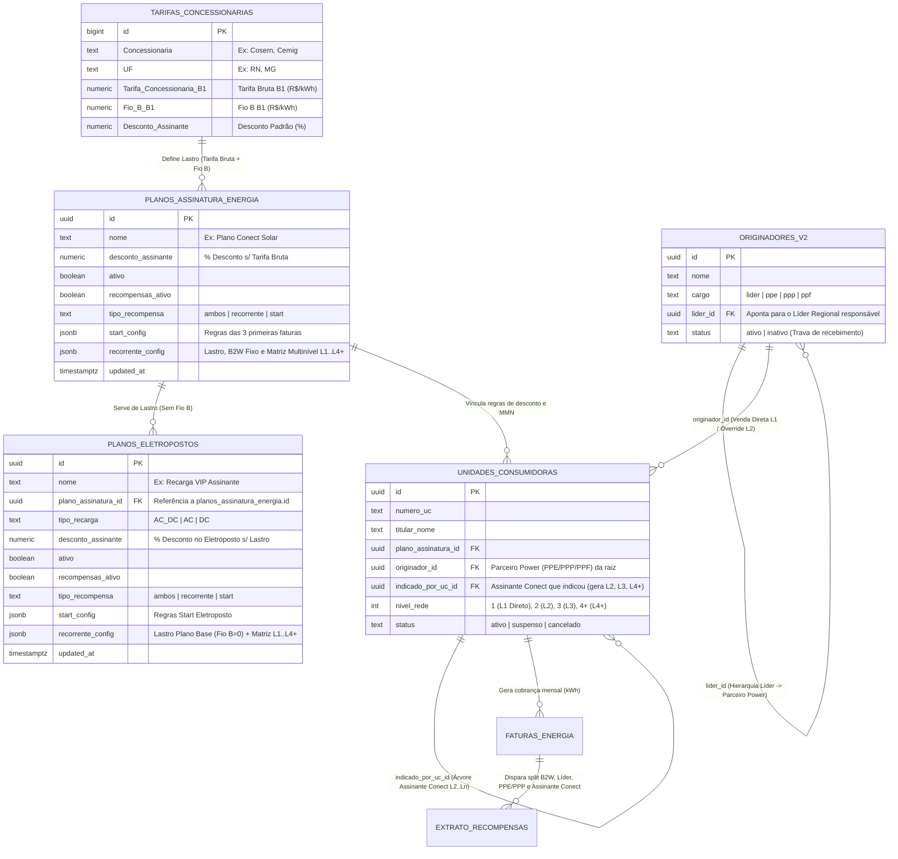

# Documentação Oficial: Regras de Recompensa, Tabelas do Banco de Dados e Relacionamentos (DER)

**Pasta Oficial no Workspace:**
`c:\Users\Godoy\Documents\HTML\WorkSpace 1 Antigravity\Plano de Recompensas\`

---

## 1. Mapa de Arquivos e Pastas do Projeto

Todos os documentos, regras de negócio e cópias dos componentes desenvolvidos para este módulo estão salvos na pasta **`Plano de Recompensas`** na raiz do seu Workspace, além dos componentes ativos de produção em `src/pages/settings/`:

| Arquivo | Caminho Completo no Workspace | Função |
| :--- | :--- | :--- |
| **`REGRAS_E_TABELAS_PLANO_DE_RECOMPENSAS.md`** | `c:\Users\Godoy\Documents\HTML\WorkSpace 1 Antigravity\Plano de Recompensas\REGRAS_E_TABELAS_PLANO_DE_RECOMPENSAS.md` | **Este documento:** Regras matemáticas completas, matriz multinível, estrutura das tabelas Supabase e relações (DER). |
| **`PLAYBOOK_PLANO_DE_RECOMPENSAS.md`** | `c:\Users\Godoy\Documents\HTML\WorkSpace 1 Antigravity\Plano de Recompensas\PLAYBOOK_PLANO_DE_RECOMPENSAS.md` | Playbook executivo com exemplos práticos em R$/kWh e simulação de faturas. |
| **`MODAL_PLANO_ASSINATURA_REFORMULADO.md`** | `c:\Users\Godoy\Documents\HTML\WorkSpace 1 Antigravity\Plano de Recompensas\MODAL_PLANO_ASSINATURA_REFORMULADO.md` | Especificação técnica de UI/UX e do Demonstrativo Dinâmico dos modais. |
| **`HISTORICO_INTEGRAL_SHARE_GEMINI.md`** | `c:\Users\Godoy\Documents\HTML\WorkSpace 1 Antigravity\Plano de Recompensas\HISTORICO_INTEGRAL_SHARE_GEMINI.md` | Transcrição integral do estudo original do Plano de Recompensas. |
| **`PlanModal.jsx` (Produção)** | `c:\Users\Godoy\Documents\HTML\WorkSpace 1 Antigravity\src\pages\settings\components\PlanModal.jsx` | Modal de **Planos de Energia por Assinatura** (Lastro na Concessionária + Fio B). |
| **`EletropostoPlanModal.jsx` (Produção)** | `c:\Users\Godoy\Documents\HTML\WorkSpace 1 Antigravity\src\pages\settings\components\EletropostoPlanModal.jsx` | Modal de **Planos de Eletropostos** (Lastro no Plano de Assinatura, sem Fio B). |
| **`PlansServicesSettings.jsx` (Produção)** | `c:\Users\Godoy\Documents\HTML\WorkSpace 1 Antigravity\src\pages\settings\PlansServicesSettings.jsx` | Tela de Configurações (`Planos e Serviços`) com as abas **Energia por Assinatura** e **Eletropostos**. |

---

## 2. Regras de Negócio e Motor Matemático do Plano de Recompensas

### 2.1. Vigência e Condição de Pagamento
- **Extinção da trava de 48 meses:** As comissões e o cashback **não expiram em 48 meses**.
- **Vínculo de Status Ativo (`status_ativo_entidade`):** O pagamento da recorrência permanece ativo de forma vitalícia enquanto **ambas as pontas** estiverem com status **`Ativo`** no sistema:
  1. A Unidade Consumidora (UC) / Assinante estiver ativa e adimplente;
  2. O recebedor (*Líder*, *Parceiro Power* ou *Assinante Conect*) estiver com cadastro **Ativo** na plataforma.

---

### 2.2. Formação da Base de Cálculo Líquida (Waterfall Financeiro)

#### A) Nos Planos de Energia por Assinatura (`PlanModal.jsx`)
O Lastro é a **Tarifa Bruta da Concessionária** selecionada (ex.: Cosern `R$ 1,0300/kWh`). Tanto a **Tarifa Bruta** quanto o **Fio B** são campos **somente leitura (`read-only`)** dentro do Demonstrativo Dinâmico, sendo alterados exclusivamente pelo cadastro da Concessionária:

$$\text{Base de Cálculo Líquida} = \text{Tarifa Bruta Concessionária} - \text{Fio B} - \text{Desconto do Assinante}$$

- **Exemplo Prático (Cosern):**
  - **1. Tarifa Bruta Concessionária (`Fixo`):** $\text{R\$ } 1,0300/\text{kWh}$ (`100,00%`)
  - **2. `(-)` Fio B (`Fixo Concessionária`):** $-\text{R\$ } 0,2130/\text{kWh}$ (`20,68%` s/ Tarifa)
  - **3. `(-)` Desconto do Assinante (`15%` s/ Tarifa):** $-\text{R\$ } 0,1545/\text{kWh}$ (`15,00%` s/ Tarifa)
  - **4. `(=)` Base de Cálculo Líquida:** $\mathbf{\text{R\$ } 0,6625/\text{kWh}}$ (**`64,32%`** da Tarifa Bruta)

#### B) Nos Planos de Eletropostos (`EletropostoPlanModal.jsx`)
O Lastro é o **Plano de Assinatura** vinculado. Como o **Fio B já foi deduzido no Plano de Assinatura**, o Plano de Eletroposto é **isento de Fio B (`R$ 0,0000`)**:

$$\text{Lastro do Eletroposto} = \text{Tarifa da Concessionária} - \text{Desconto do Assinante do Plano Base}$$

$$\text{Base de Cálculo Líquida (Eletroposto)} = \text{Lastro do Eletroposto} - \text{Desconto do Eletroposto}$$

---

### 2.3. Regra da Mantenedora: B2W (Gestão / Plataforma) — Recorrência Fixa
- A **B2W (Gestão / Plataforma)**, como mantenedora tecnológica e operacional do ecossistema, **sempre recebe sua alíquota de recorrência fixa em todos os níveis de assinante (`L1`, `L2`, `L3` e `L4+`)**.
- **Comportamento no Modal:** Não possui seletores de corte de nível. É configurada por um **input único centralizado (`% s/ Base Líquida — Recorrência Fixa`)**, idêntico à linha do *Desconto do Assinante*.
- **Valor de Referência:** `10,00%` sobre a Base de Cálculo Líquida ($\text{R\$ } 0,06625/\text{kWh}$ ou `6,43%` da Tarifa Bruta em todos os níveis).

---

### 2.4. Matriz Multinível (`L1`, `L2`, `L3`, `L4+`) e Direito de Níveis por Função

Todas as comissões abaixo incidem **sobre a Base de Cálculo Líquida** ($\text{R\$ } 0,6625/\text{kWh}$ no exemplo Cosern):

| Cargo / Função | Regra de Níveis (`max_niveis`) | Nível 1 (`L1` — Venda Direta) | Nível 2 (`L2` — 1ª Indicação) | Nível 3 (`L3` — 2ª Indicação) | Nível 4+ (`L4+` — Rede Profunda) |
| :--- | :--- | :---: | :---: | :---: | :---: |
| **1. B2W (Gestão / Plataforma)** | **Recorrência Fixa** (Sem marcação de nível) | **`10,00%`** (`R$ 0,06625`) | **`10,00%`** (`R$ 0,06625`) | **`10,00%`** (`R$ 0,06625`) | **`10,00%`** (`R$ 0,06625`) |
| **2. Líder / Coordenador** | **Até 3 Níveis (`L1 a L3`)** | **`1,00%`** (`R$ 0,006625`) | **`1,00%`** (`R$ 0,006625`) | **`1,00%`** (`R$ 0,006625`) | **`0,00%`** *(Corte em L4+)* |
| **3. Parceiro Power (`PPE` / `PPP`)** | **Até 2 Níveis (`L1 e L2`)** | **`4,00%`** (`R$ 0,02650`) | **`2,00%`** (`R$ 0,01325`) | **`0,00%`** *(Corte em L3)* | **`0,00%`** *(Corte em L4+)* |
| **3.1. Parceiro Power Free (`PPF`)** | **Sem Recorrência** (Ganha Bônus Start) | **`0,00%`** | **`0,00%`** | **`0,00%`** | **`0,00%`** |
| **4. Assinante Conect (`MGM`)** | **Infinito a partir de `L2`** | **`0,00%`** *(Sem indicação)* | **`2,00%`** (`R$ 0,01325`) | **`2,00%`** (`R$ 0,01325`) | **`2,00%`** (`R$ 0,01325`) |
| **Total Deduções (% s/ Base)** | — | **`15,00% s/ Base`** (`9,65% Tarifa`) | **`15,00% s/ Base`** (`9,65% Tarifa`) | **`13,00% s/ Base`** (`8,36% Tarifa`) | **`12,00% s/ Base`** (`7,72% Tarifa`) |
| **Líquido Efetivo Fornecedor** | — | **`R$ 0,563125`** (`54,67%`) | **`R$ 0,563125`** (`54,67%`) | **`R$ 0,576375`** (`55,96%`) | **`R$ 0,583000`** (`56,60%`) |
| **Mínimo Exigido Fornecedor** | Piso Contratual (`50%` Tarifa) | `R$ 0,515000` (`50,00%`) | `R$ 0,515000` (`50,00%`) | `R$ 0,515000` (`50,00%`) | `R$ 0,515000` (`50,00%`) |
| **SUPERÁVIT / MARGEM LIVRE** | **Trava Anti-Déficit (`>= 0`)** | **`+R$ 0,048125 (+4,67%)`** | **`+R$ 0,048125 (+4,67%)`** | **`+R$ 0,061375 (+5,96%)`** | **`+R$ 0,068000 (+6,60%)`** |

#### Subcategorias do Parceiro Power:
1. **`PPE` (Parceiro Power Embaixador):** Categoria máxima de originação comercial (`4%` em `L1`, `2%` em `L2`, + Bônus Start).
2. **`PPP` (Parceiro Power Premium):** Categoria comercial recorrente (`4%` em `L1`, `2%` em `L2`, + Bônus Start).
3. **`PPF` (Parceiro Power Free):** Categoria de entrada gratuita; recebe o **Bônus Start** (comissionamento sobre as 3 primeiras faturas), porém possui `0%` na recorrência mensal (gerando superávit adicional imediato de `+2,57%` em `L1`).

---

## 3. Tabelas do Banco de Dados (Supabase) e Relacionamentos

### 3.1. Diagrama Entidade-Relacionamento (DER)



---

### 3.2. Detalhamento das Tabelas e Colunas (`JSONB`)

#### 1. Tabela `Tarifas Concessionarias`
- **Responsabilidade:** Fonte única de verdade (*Single Source of Truth*) para a **Tarifa Bruta** e o **Fio B**.
- **Relação com os Modais:** Alimenta em modo **somente leitura (`read-only`)** os campos `Tarifa Bruta` e `Fio B` no modal de Planos de Assinatura (`PlanModal.jsx`).

#### 2. Tabela `planos_assinatura_energia`
Armazena os planos de Energia por Assinatura e toda a parametrização da Matriz Multinível na coluna `recorrente_config` (`JSONB`):
```json
{
  "vigencia_tipo": "status_ativo_entidade",
  "meses": null,
  "lastro_tarifario": {
    "concessionaria_key": "Cosern__RN",
    "concessionaria_nome": "Cosern",
    "subgrupo": "B1",
    "tarifa_bruta": 1.03,
    "fio_b": 0.213,
    "base_calculo_liquida": 0.6625,
    "piso_fornecedor_pct": 50,
    "liquido_efetivo_fornecedor": 0.563125,
    "margem_livre_excedente": 0.048125,
    "superavit_por_nivel": {
      "L1": 0.048125,
      "L2": 0.048125,
      "L3": 0.061375,
      "L4": 0.068000
    }
  },
  "regras": {
    "b2w": 10,
    "lider": 1,
    "ppe": 4,
    "ppp": 4,
    "ppf": 0,
    "assinante_conect": 2
  },
  "regras_multinivel": {
    "b2w": {
      "max_niveis": 4,
      "niveis": { "L1": "10", "L2": "10", "L3": "10", "L4": "10" }
    },
    "lider": {
      "max_niveis": 3,
      "niveis": { "L1": "1", "L2": "1", "L3": "1", "L4": "0" }
    },
    "ppe": {
      "max_niveis": 2,
      "niveis": { "L1": "4", "L2": "2", "L3": "0", "L4": "0" }
    },
    "ppp": {
      "max_niveis": 2,
      "niveis": { "L1": "4", "L2": "2", "L3": "0", "L4": "0" }
    },
    "ppf": {
      "max_niveis": 0,
      "niveis": { "L1": "0", "L2": "0", "L3": "0", "L4": "0" }
    },
    "assinante_conect": {
      "max_niveis": 4,
      "niveis": { "L1": "0", "L2": "2", "L3": "2", "L4": "2" }
    }
  }
}
```

#### 3. Tabela `planos_eletropostos`
Armazena os planos de recarga veicular. Possui chave estrangeira lógica `plano_assinatura_id` apontando para `planos_assinatura_energia.id`.
- Herda automaticamente o **Lastro** (`Tarifa da Concessionária - Desconto do Assinante do Plano Base`).
- Define `fio_b: 0` em `lastro_tarifario` (pois o Fio B já foi descontado no Plano de Assinatura).
- Possui a mesma estrutura `regras_multinivel` com `b2w` fixa em todos os níveis e cortes parametrizáveis por cargo.
