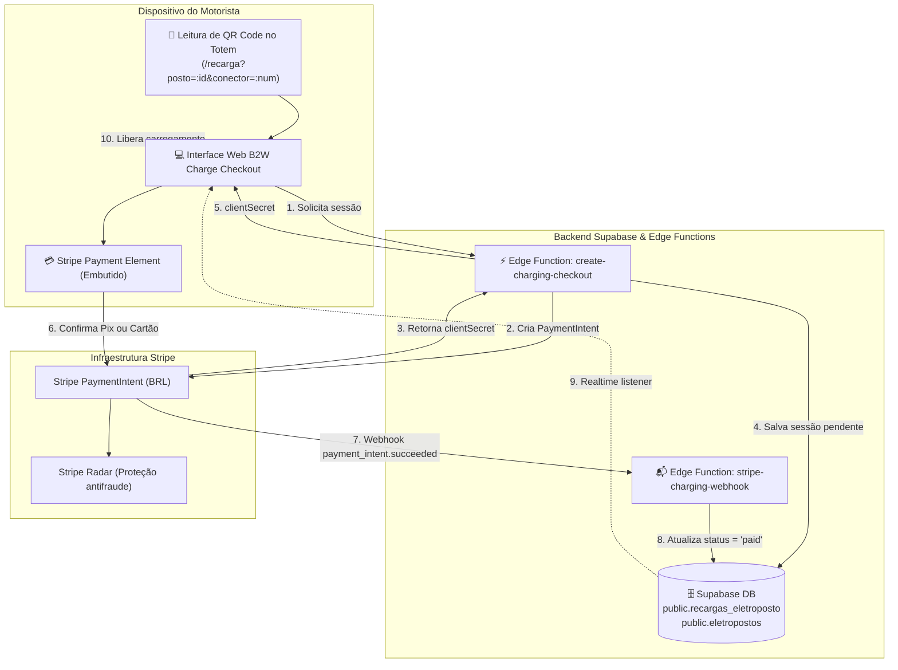

# Especificação de Design: Checkout de Recarga de Eletropostos (B2W Charge)

- **Data:** 30/09/2026
- **Status:** Aprovado
- **Autor:** Antigravity & B2W Energia
- **Módulo:** B2W Charge (Eletropostos)

---

## 1. Contexto e Objetivos

A B2W Energia gerencia uma rede de eletropostos inteligentes (B2W Charge) integrados a estações de recarga rápida e semirrápida. O objetivo deste projeto é fornecer uma experiência de pagamento fluida, de alta conversão e com confirmação em tempo real para recargas de veículos elétricos, atendendo a dois perfis de motoristas:

1. **Motoristas Avulsos (Sem Cadastro Prévio):**
   - O motorista aproxima o veículo do eletroposto e lê o QR Code fixado no totem com a câmera do celular.
   - Acessa diretamente a página web de checkout com o ID do eletroposto e o conector pré-selecionados via parâmetros de URL.
   - Seleciona o valor desejado (ou kWh estimado), informa dados mínimos de contato (Nome, E-mail ou WhatsApp) e realiza o pagamento imediato via **PIX** ou **Cartão de Crédito**.
2. **Motoristas Cadastrados (Drivers no App B2W Energia):**
   - Motorista autenticado com login e perfil.
   - Pode utilizar cartões de crédito salvos com segurança via Stripe Customer / SetupIntent.
   - Acompanha histórico de recargas, faturas e saldo acumulado.

---

## 2. Arquitetura da Solução



---

## 3. Modelo de Dados

### Tabela `public.recargas_eletroposto`

Armazena cada solicitação e histórico de sessão de recarga vinculada aos eletropostos existentes na tabela `public.eletropostos`.

```sql
CREATE TABLE IF NOT EXISTS public.recargas_eletroposto (
    id UUID PRIMARY KEY DEFAULT gen_random_uuid(),
    eletroposto_id UUID REFERENCES public.eletropostos(id) ON DELETE SET NULL,
    conector_numero INTEGER NOT NULL DEFAULT 1,
    tipo_usuario TEXT NOT NULL CHECK (tipo_usuario IN ('avulso', 'cadastrado')),
    user_id UUID REFERENCES auth.users(id) ON DELETE SET NULL,
    motorista_nome TEXT,
    motorista_email TEXT,
    motorista_telefone TEXT,
    valor NUMERIC(10, 2) NOT NULL,
    kwh_estimado NUMERIC(10, 2),
    tarifa_kwh_aplicada NUMERIC(10, 4),
    stripe_payment_intent_id TEXT UNIQUE,
    stripe_customer_id TEXT,
    status TEXT NOT NULL DEFAULT 'pending_payment' CHECK (
        status IN ('pending_payment', 'paid', 'charging', 'completed', 'failed', 'canceled')
    ),
    metadata JSONB DEFAULT '{}'::jsonb,
    created_at TIMESTAMP WITH TIME ZONE DEFAULT timezone('utc'::text, now()) NOT NULL,
    updated_at TIMESTAMP WITH TIME ZONE DEFAULT timezone('utc'::text, now()) NOT NULL
);

-- Índices de consulta rápida
CREATE INDEX IF NOT EXISTS idx_recargas_eletroposto_posto ON public.recargas_eletroposto(eletroposto_id);
CREATE INDEX IF NOT EXISTS idx_recargas_eletroposto_status ON public.recargas_eletroposto(status);
CREATE INDEX IF NOT EXISTS idx_recargas_eletroposto_pi ON public.recargas_eletroposto(stripe_payment_intent_id);

-- Habilitar Row Level Security (RLS)
ALTER TABLE public.recargas_eletroposto ENABLE ROW LEVEL SECURITY;

-- Políticas de segurança
-- Leitura anônima para acompanhar o status da própria sessão criada
CREATE POLICY "Permitir leitura da recarga pelo ID" 
ON public.recargas_eletroposto 
FOR SELECT 
USING (true);

-- Inserção via Edge Function ou cliente autenticado/anônimo
CREATE POLICY "Permitir criacao de solicitacao de recarga" 
ON public.recargas_eletroposto 
FOR INSERT 
WITH CHECK (true);
```

---

## 4. Backend: Supabase Edge Functions

### 4.1. Edge Function `create-charging-checkout`
- **Caminho:** `supabase/functions/create-charging-checkout/index.ts`
- **Função:** Recebe os parâmetros de recarga, calcula a estimativa de kWh, registra a intenção no banco de dados e cria o `PaymentIntent` no Stripe.
- **Entrada:**
  ```json
  {
    "eletroposto_id": "uuid-da-estacao",
    "conector_numero": 1,
    "valor": 50.00,
    "motorista": {
      "nome": "João Silva",
      "email": "joao@email.com",
      "telefone": "11999998888"
    },
    "save_card": false
  }
  ```
- **Processamento Stripe:**
  - Instancia `new Stripe(STRIPE_SECRET_KEY, { apiVersion: '2026-08-26.dahlia' })`.
  - Configura `amount: Math.round(valor * 100)` (em centavos).
  - Define `currency: 'brl'`.
  - Habilita `automatic_payment_methods: { enabled: true }`.
  - Preenche `metadata`:
    - `eletroposto_id`
    - `conector_numero`
    - `recarga_id`
    - `tipo_usuario`
- **Saída:**
  ```json
  {
    "success": true,
    "clientSecret": "pi_123_secret_456",
    "paymentIntentId": "pi_123",
    "recargaId": "uuid-gerado",
    "kwh_estimado": 25.5
  }
  ```

### 4.2. Edge Function `stripe-charging-webhook`
- **Caminho:** `supabase/functions/stripe-charging-webhook/index.ts`
- **Função:** Recebe os eventos assíncronos do Stripe com verificação de assinatura criptográfica (`stripe.webhooks.constructEvent`).
- **Eventos escutados:**
  - `payment_intent.succeeded`: Atualiza `recargas_eletroposto.status = 'paid'`, registra carimbo de data/hora e dispara a liberação de carga para o carregador (via broker OCPP Joult ou sinalizador de liberação).
  - `payment_intent.payment_failed`: Atualiza `recargas_eletroposto.status = 'failed'`.

---

## 5. Frontend: Interface de Checkout (`ChargingCheckout.jsx`)

- **Caminho:** `src/pages/public/ChargingCheckout.jsx`
- **Rota no App:** `/recarga` (disponível publicamente sem exigência de autenticação para motoristas avulsos, e com preenchimento automático se logado).
- **Componentes:**
  1. **Header do Eletroposto:** Exibe nome da estação, endereço e conector selecionado. Se o motorista abrir `/recarga` sem parâmetros, pode buscar ou selecionar o posto em uma lista/mapa.
  2. **Seletor de Valor / kWh:**
     - Botões de valores rápidos: R$ 30,00, R$ 50,00, R$ 100,00.
     - Campo de valor livre (ex: R$ 45,00).
     - Badge dinâmico de estimativa: *"R$ 50,00 equivalem a ~25 kWh (aprox. 150 km de autonomia)"*.
  3. **Identificação Rápida:**
     - Se logado: exibe *"Conectado como [Nome]"*.
     - Se avulso: solicita Nome e E-mail/WhatsApp para receber o comprovante.
  4. **Stripe Elements Container:**
     - Integração com `@stripe/stripe-js` e `@stripe/react-stripe-js`.
     - Layout com abas para Pix e Cartão de Crédito.
     - No PIX: Renderização do QR Code gerado pelo Stripe, botão "Copiar Chave Pix" e contador regressivo.
  5. **Monitoramento e Tela de Sucesso:**
     - Escuta atualizações da sessão via Supabase Realtime (`postgres_changes` em `recargas_eletroposto`).
     - Assim que o pagamento é identificado: animação de sucesso com instruções de conexão do plugue no veículo.

---

## 6. Diretrizes e Boas Práticas do Stripe Aplicadas

1. **Instanciação Segura:** Uso exclusivo de instâncias de `StripeClient` modernas no backend.
2. **Dynamic Payment Methods:** Parâmetro `payment_method_types` **não** é fixado no código, permitindo que a Stripe determine dinamicamente a elegibilidade de Pix, Cartões e Carteiras Digitais no Dashboard.
3. **Idempotência:** Transações são registradas previamente no banco com UUID gerado pela aplicação, evitando duplicações em reenvios de formulário.
4. **Isolamento de Chaves:** A chave secreta (`sk_test_...`) permanece restrita às variáveis de ambiente do backend/Edge Functions. O frontend consome apenas a chave pública publicável (`pk_test_...`) e o `clientSecret` individual de cada transação.

---

## 7. Plano de Verificação e Testes

1. **Teste de Criação de Sessão:** Chamar a Edge Function com parâmetros de teste e validar retorno de `clientSecret`.
2. **Teste de UI do Checkout:** Acessar `/recarga` com e sem parâmetros de URL, verificando a renderização do formulário.
3. **Teste de Pagamento com Cartão de Teste:** Executar pagamento de teste com os cartões fornecidos pelo Stripe (`4242 4242...`) e verificar confirmação 3DS.
4. **Teste de Pagamento com Pix de Teste:** Simular autorização de Pix em ambiente de teste e validar a transição automática da tela para "Pagamento Aprovado".
